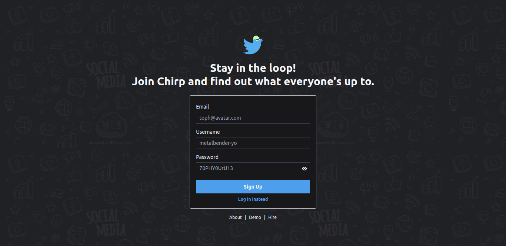

## Intro

Chirp is a Twitter clone in its very early stages. It's built using React and Spring Boot. The source requires Java >= 17 to build and run locally.  

## Configuration

You can Chirp locally if you are willing to go through some initial setups.

### Database Configuration

1. Install MySQL >= 8.0.3x.
2. Create a new database called `twitter_clone`.
3. Execute the `schema.sql` script in MySQL console in order to generate the required table schema. 
4. Edit `application.properties` and set the database credentials.

### Application Configuration

In addition to MySQL specific fields in `application.properties`, one needs to set up the mail server and JWT secret.

An email server is required for sending real emails to users to verify their email as they Sign Up or when they issue
a password change request. The mail server requires these properties:

```properties
spring.mail.host=<host>
spring.mail.port=<port>
spring.mail.username=<username>
spring.mail.password=<password>

# Set this to false if authentication isn't required.
spring.mail.properties.mail.smtp.auth=true
# Set this to false if not using TLS.
spring.mail.properties.mail.smtp.starttls.enable=true
```

We are using JWT tokens for authentication. You must configure a JWT secret by setting this property: 

```properties
security.jwt.secret=<your-mother's-maiden-name>
```

## Run

The `client` directory contains source for the front-end. The client-side is React based. In order to run the application,
the React front-end as well as the Spring Boot back-end need to run in parallel. Furthermore, they must serve specifically
on the following URLs:

    Front-end: http://localhost:3000
    Back-end: http://localhost:8080

These are default for React and Spring Boot, respectively. If there's a port-conflict in your machine and either `3000`
or `8080` isn't available, the application won't function properly (although you can still get it to boot).

**Fire up the back-end:**

```shell
cd Chirp
mvn spring-boot:run
```

**Fire up the front-end:**

```shell
cd Chirp/client
npm start
```

If the stars align just right for you, the following page should pop open in your browser window.

Check out that cool logo!


